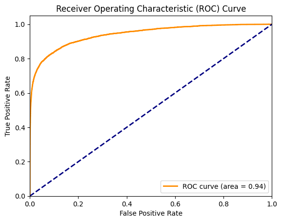
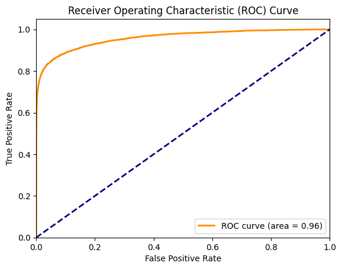

# TP Final Aprendizaje de Máquina I - IEEE-CIS Fraud Detection

Este repositorio contiene el trabajo práctico final de la materia Aprendizaje de Máquina I de la Especialización en Inteligencia Artificial (CEIA) de la Facultad de Ingeniería de la Universidad de Buenos Aires (FIUBA). 

Para este trabajo práctico se abordó la tarea de la predicción de transacciones fraudulentas en tarjetas de crédito. El dataset utilizado es provisto por Vesta Corporation y contiene un conjunto de datos de transacciones de comercio electrónico, con el objetivo de predecir si una transacción es fraudulenta o no. El dataset fue obtenido de la competencia de Kaggle [IEEE-CIS Fraud Detection](https://www.kaggle.com/c/ieee-fraud-detection).

# Estrategia de resolución

Para resolver el problema de clasificación de transacciones fraudulentas, se implementaron diferentes modelos de aprendizaje supervisado. Se realizaron tareas de preprocesamiento y exploración de datos, ingeniería de features, selección de modelos y ajuste de hiperparámetros. De esa manera, se utilizaron varios notebooks para dividir el trabajo en diferentes etapas.

1. [Análisis exploratorio de datos](notebooks/data_exploration_notebook.ipynb): En este notebook se realizó un análisis exploratorio de los datos, se identificaron patrones y se visualizaron las distribuciones de las variables. Se analizaron las variables categóricas y numéricas, se estudiaron las correlaciones y se identificaron posibles features relevantes para la predicción.

2. [Ingeniería de features](notebooks/feature_engineering_notebook.ipynb): En este notebook se realizaron tareas de preprocesamiento y limpieza de datos. Se crearon nuevas features a partir de las variables existentes, se imputaron valores faltantes y se codificaron las variables categóricas. 

3. [LightGBM](notebooks/lightgbm_model_notebook.ipynb): En este notebook se implementó un modelo de Gradient Boosting utilizando la librería LightGBM. Se empleo el dataset de entrenamiento dividido en un conjunto de entrenamiento y otro de validación para ajustar los hiperparámetros del modelo. También se obtuvo el archivo [submission_lightgbm.csv](submissions/submission_lightgbm.csv) con las predicciones del modelo en el conjunto de test.

4. [XGBoost](notebooks/xgboost_notebook.ipynb): En este notebook se implementó un modelo de Gradient Boosting utilizando la librería XGBoost. De manera similar al caso anterior, se ajustaron los hiperparámetros del modelo y se obtuvo el archivo [submission_xgboost.csv](submissions/submission_xgboost.csv) con las predicciones del modelo en el conjunto de test.

# Resultados del Modelo

### Comparación de Modelos en el Dataset IEEE-CIS Fraud

| Métrica             | Modelo LightGBM  | Modelo XGBoost        |
|---------------------|------------------|-----------------------|
| Exactitud           | 0.9792           | 0.9854                |
| Precisión (Clase 0) | 0.9807           | 0.9872                |
| Recall (Clase 0)    | 0.9981           | 0.9979                |
| F1-Score (Clase 0)  | 0.9893           | 0.9925                |
| Precisión (Clase 1) | 0.8956           | 0.9169                |
| Recall (Clase 1)    | 0.4581           | 0.6424                |
| F1-Score (Clase 1)  | 0.6062           | 0.7555                |
| AUC de Validación   | 0.9409           | 0.9587                |
| Tiempo de Inferencia| 5.726 segundos   | 52.976 segundos       |
| Tamaño del Modelo   | 0.82 MB          | 22.21 MB              |

### Curvas ROC de los Modelos

<table>
  <tr>
    <td align="center"><b>LightGBM</b> </td>
    <td align="center"><b>XGBoost</b> </td>
  </tr>
</table>

### Resultados empleando el conjunto de prueba

Para evaluar los modelos empleando el conjunto de test provisto por la competencia de Kaggle, se realizo la carga de los archivos de predicciones y se obtuvieron los siguientes resultados:

| Archivo                   | Private Score | Public Score |
|---------------------------|---------------|--------------|
| submission_lightgbm.csv   | 0.885567      | 0.918826     |
| submission_xgboost.csv    | 0.863551      | 0.903624     |
